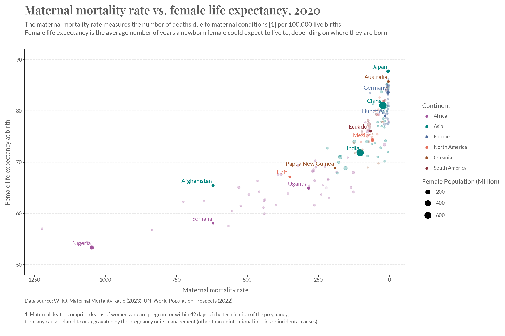

# Maternal Mortality Rate vs Female Life Expectancy (2020)

The purpose of this notebook is to compare maternal mortality rate (MMR) with female life expectancy (FLE) for the year 2020, across the globe.

It utilises [Plotnine](https://plotnine.org/) to create a clean, OWID-style scatterplot.

Some useful features incorporated include:
- Setting custom fonts for the title and footnotes
- Colour-coding countries by continent
- Using size to display population

The final plot:

